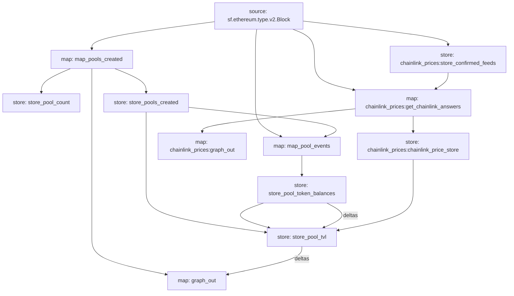

# Uniswap V3 Demo Substreams-powered Subgraph

This repository contains a Substreams-powered Subgraph (SPS) designed to track and analyze a basic subset of Uniswap V3 pools data. It serves as a practical reference for the "Builders DAO - Substreams Developer Basics Guide".

The repository demonstrates the use of general good practices for organizing and developing a Substreams project. It includes modules for extracting, transforming, and analyzing data from the Uniswap V3 protocol on the Ethereum blockchain.

The SPS makes use of the following Substreams features:
1. Event extraction and `Pool` creation from a known data-source.
2. Event extraction from data-source that are not known (e.g., events from `Pool`'s that are deployed by a Factory contract).
3. Use of RPC calls to fetch `Token` data.
4. Store modules to aggregate balances and TVL data.
5. `graph_out` module to emit `EntityChanges` that can be consumed by a Subgraph.

For a detailed guide on building and deploying Substreams packages, refer to the [Builders DAO - Substreams Developer Basics Guide](). // TODO add guide URL

## Project Structure

The repository is organized using general best practices for Substreams projects, ensuring modularity and maintainability.

- `src/`: Contains the Rust source code for the Substreams modules.
    - `src/modules/`: Contains all the Substreams modules, splitting these up allows for a cleaner codebase that is easier to navigate and understand.
    - `src/rpc/`: Contains all functionality related to RPC calls, in this case, a get_token function which gets a token protobuf using data from a batch RPC call.
    - `src/pb/`: Rust bindings generated from the protobuf definitions.
- `proto/`: Protobuf definitions for the data structures used in the project.
- `substreams.yaml`: Configuration file for the Substreams package.
- `subgraph.yaml`: Configuration file for the Subgraph.
- `schema.graphql`: Contains the entity definitions for the Subgraph.
- `Makefile`: Contains build and deployment commands for the project.

## Data Flow

